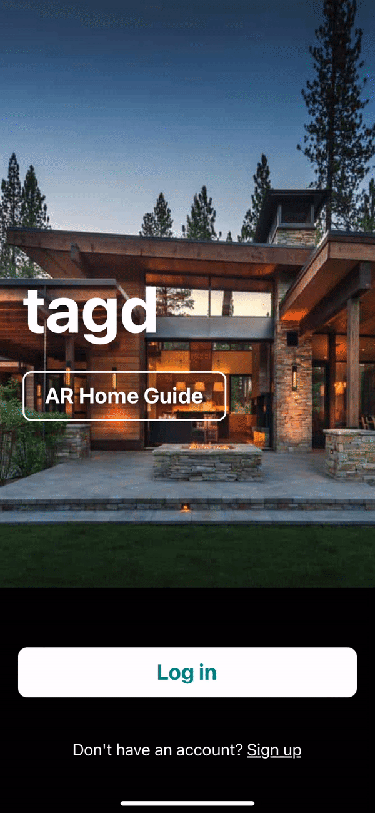
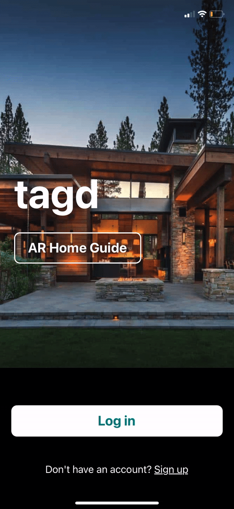

# Tagd
Tagd is an augmented reality mobile application that allow hosts to create and display personalized messages to help guests access and locate necessities in and around their property.

## Preview
Host

Guest

## Tech Stack
- 
- 
- 
- 
- 
- 
- 
- 
- 

## Setup
- `git clone git@github.com:davdli/Tagd_Frontend.git` in terminal
- `npm install` and `npm start` in project root directory
- Install Viro Media app from App Store or Google Playstore
- In Viro Media app, click hamburger menu then click Enter Testbed
- Enter ngrok endpoint located in terminal and enjoy!

## Developers
- <a href="https://github.com/davdli">David Li</a>
- <a href="https://github.com/gregbabbert">Greg Babbert</a>
- <a href="https://github.com/trzaidi">Tai Zaidi</a>
- <a href="https://github.com/tscalfaro">Tony Scalfaro</a>
